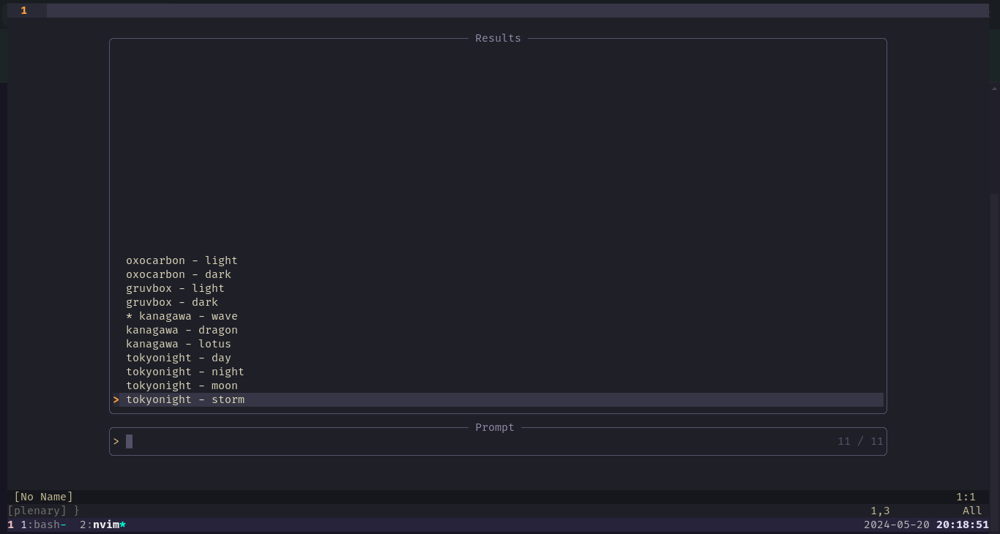

# themify
A theme selector plugin on top of telescope

# Demo
As seen below, once setup we can easily pull up a telescope menu to select the theme


# Setup
Lazy.nvim setup
```lua themes.lua
return {
	{
		"cool-pants/themify",
		dependencies = {
			"rebelot/kanagawa.nvim",
			"ellisonleao/gruvbox.nvim",
			"nyoom-engineering/oxocarbon.nvim",
			"folke/tokyonight.nvim",
		},
		config = function()
			local themes = require("themify").setup({
				modDir = os.getenv("HOME") .. "/.config/nvim/lua/themes/",
				themesModPath = "themes.",
			})
			themes.get_current_theme()
            -- Mapping for the menu to show up
			vim.keymap.set("n", "<leader>th", themes.select_theme_telescope, {})
            -- Command to reload the themes list upon file add (this may not work in case of Lazy loading themes)
			vim.api.nvim_create_user_command("ThemifySync", "lua require('themify').reload_config()", { bang = true })
		end,
	},
}
```

Example theme config file
```lua .config/nvim/lua/themes/tokyonight.lua
return {
	name = "tokyonight",
	style = { "storm", "moon", "night", "day" },
	transparent = false,
	activate = function(style, transparent)
		require("tokyonight").setup({
			style = style,
			transparent = transparent,
		})

		vim.cmd.colorscheme("tokyonight")
	end,
}
```
